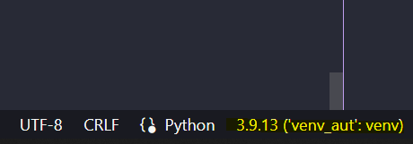
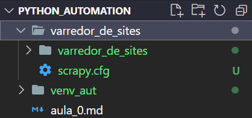

CRIAR UM MD: 
https://medium.com/analytics-vidhya/how-to-create-a-readme-md-file-8fb2e8ce24e3

## Entender os conceitos Gerais do processo de **Automação**

- Esse processo sera realizado parcialmente pelo PC ?

**MODO DEBUG** 

F9 marca o break point;

F5 abre o executor de debug;

## PyautoGUI - Automação Desktop

VANTAGENS:
- Facil de aprender;
- Baixa manutenção;
- Dificil ser bloqueado e ser detectado;
- Pode ser usado WEB e Desktop;

DESVANTAGENS:
- Depende da resolução da tela;
- Se usado no mesmo computador de uso, trava o uso do mesmo;
- Utlizado para automatizar, não para scraper;

## Selenium - Automação sistemas WEB

VANTAGENS:
- Não atrapalha o uso do computador;
- Pode ser hospedado facilmente na nuvem;
- Pode ser usado para varrer dados, mas o foco é automação.

DESVANTAGENS:
- Se o dominio mudar, precisamos atualizar;
- Somente sistemas WEB;
- Precisa do navagador;

COMANDOS:
> voltar - driver.back()
> avançar - driver.forward()
> atualizar - driver.refresh()
> url atual - driver.current_url
> nova aba - driver.switch_to.new_window('tab')
> Screenshot - driver.save_screenshot('./image.png')
> Finalizar - driver.quit()

## Scrapy - Web Scrapping

VANTAGENS:
- Não precisa de navegador, pode ser utilizado somente no CMD;
- Mais rapido que o Selenium;

DESVANTAGENS:
- Somente sistemas WEB;

# ------ ROBOTS.TXT

É super importante, pois contem dados e regras para o scraper.

- User-agent - O nome do bot
- Disallow - Lista das paginas que o bot não deve varrer.

# ------ SCRAPY

Apos configurar e ativar o ambiente virtual.

Sempre checar se o Interpreter esta no venv

Rodar o codigo abaixo no terminal:

`scrapy startproject varredor_de_sites`

Irá aparecer a seguinta pasta

Dentro da pasta spiders, criar um novo arquivo que ira conter o script.

Para rodar esse novo bot, ir no terminal e chamar o arquivo:

`scrapy crawl <nome_bot>`

# ----- SCRAPY - XPATH
Podemos extrair dados atraves do Xpath ou seletores CSS.

Link de teste : https://cursoautomacao.netlify.app/

F12 abre os elementos.

**// tag[@atributo = 'valor']**

Ctrl + F - pesquisar: 

//h4[text() = 'Checkbox')]
-> h4 é o header.

//*[contains(text(),'Dropdown')]
- Ira retornar todas as tags com Dropdown.

//*[contains(text(),'Dropdown') or starts-with(text(),'Exemplo')]
- Ira retornar Dropdown e Exemplo (start).

//div[@div = 'select-class']//fields//h4
- Ira retornar o filho do div definido.

### Pegar o valor

Coloca text() no final do argumento:

//span[@class='text']/text()

> Teste do XPATH na hora

Na mesma seção, clicar em CONSOLE e colar o codigo `$x("//span[@class='text']/text()")`

O valor ira retornar em nodeValue.